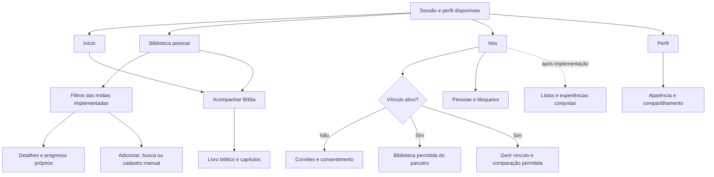

# Navegação da expansão — PROD-02

## Estado e escopo

Definição v1 preparada e revisada documentalmente em **08/10/2026**, a pedido do usuário para avançar na próxima tarefa. Conclui o mapa e os fluxos de PROD-02; a implementação pertence a UI-01 e suas dependências. Não representa telas já construídas, validação com usuários ou aprovação específica do desenho pelo usuário. Ajustes decorrentes de protótipos e uso real ficam em PROD-03/UI-03.

Referências: [MVP aprovado](PRODUCT.md#mvp-aprovado--prod-01), [política do casal](COUPLE_POLICY.md), [arquitetura atual](ARCHITECTURE.md) e [sistema visual](DESIGN.md). Marca, fornecedores, esquema e regras detalhadas de séries continuam decisões separadas.

Hoje, `MainNavigation` oferece **Início, Estante, Bíblia e Perfil**. A estante reúne abas pessoais/do parceiro e estados de leitura; o perfil oferece convites e compartilhamento. Nada disso foi alterado nesta entrega documental.

## Estrutura definida

Manter quatro destinos principais: **Início, Biblioteca, Nós e Perfil**. Categorias ficam dentro da Biblioteca, evitando que cada nova mídia aumente a barra principal. O espaço Nós reúne a consulta do parceiro e a gestão da relação; a biblioteca pessoal continua utilizável sem vínculo. A Bíblia conserva uma jornada própria de progresso.

| Destino | Conteúdo e ações | Limite |
| --- | --- | --- |
| Início | Resumo pessoal, atividades permitidas e atalhos para adicionar item e acompanhar Bíblia; resumo do casal quando houver relação ativa. | Métricas por mídia; nunca somar capítulos, episódios, filmes e escutas numa mesma unidade. Feed conjunto segue o início do aceite, sem reconstruir passado. |
| Biblioteca | Registros próprios, filtros por mídia e estado compatível, busca na biblioteca quando implementada e ação Adicionar. Acesso explícito “Acompanhar Bíblia”. | Edita somente dados do dono. Categoria aparece apenas com cadastro, consulta e atualização funcionais. |
| Nós | Relação/convites, biblioteca compartilhada do parceiro, comparação permitida da Bíblia, pessoas/bloqueios; listas e experiências quando entregues. | Consulta compartilhada não permite alterar registros do parceiro. Conteúdo condicionado ao vínculo atual e às regras do servidor. |
| Perfil | Nome/foto próprios, aparência, compartilhamento pessoal e saída. Mantém atalhos para Convites do casal e Pessoas e bloqueios. | Não cria uma segunda lógica de vínculo. Atalhos levam às mesmas telas acessíveis em Nós. Exportação/exclusão só entram após SEC-05. |

O diagrama é um mapa de destino, não uma lista de rotas já disponíveis. Mesmo os caminhos com funcionalidades atuais precisam ser conectados à nova navegação em UI-01.

## Biblioteca e inclusão individual

Filtros de mídia: **Todos, Livros, Filmes, Séries e Músicas**, limitados às categorias entregues. Músicas distingue **Faixas** e **Álbuns** em um filtro secundário. Todos reúne somente entradas de biblioteca, com identificação do tipo; não inclui capítulos bíblicos, episódios isolados ou registros de escuta como se fossem obras independentes.

Estados e ações seguem o MVP de cada mídia: livros preservam Lendo/Lidos/Quero ler e conclusão opcional; filmes usam Quero assistir/Assistido; séries têm progresso por episódio e estados gerais próprios; músicas têm favorito e escutas separados. Filtros não convertem essas categorias num status universal. Busca textual na biblioteca e filtros por período dependem de BOOK-02/DATA-04, sem promessa de disponibilidade na primeira etapa de UI-01.

1. Biblioteca → escolher mídia → **Adicionar livro/filme/série/música**. Em Todos, Adicionar abre a escolha entre mídias implementadas; em Músicas, escolher faixa/álbum antes do formulário.
2. Busca da mídia → resultado → detalhes → salvar na própria biblioteca. **Cadastrar manualmente** fica disponível também sem resultado, configuração de catálogo ou conexão ao fornecedor. Falha de catálogo não deve bloquear esse formulário.
3. Cadastro manual solicita os campos obrigatórios da mídia e aceita metadados opcionais ausentes. O retorno ocorre somente após confirmação da escrita pessoal; falta de acesso à persistência mantém o formulário e oferece nova tentativa, sem prometer gravação offline.
4. Retornar à mídia, filtro e posição de origem, com o item confirmado disponível. Cancelar não cria registro; fechar durante operação segue as proteções de ciclo de vida atuais.
5. Detalhes pessoais → atualizar estado/progresso/data/favorito ou registrar escuta, conforme a categoria → confirmação → retornar ao mesmo contexto. Nenhuma ação pessoal altera o parceiro ou confirma uma experiência conjunta.

No Início, Adicionar abre a mesma jornada de escolha de mídia. Não presume a categoria de uma atividade do parceiro nem copia seu registro pessoal.

## Acesso e comparação da Bíblia

**Biblioteca → Acompanhar Bíblia → Antigo/Novo Testamento → livro → capítulos**. O acesso fica antes dos filtros da biblioteca e permanece disponível qualquer que seja a mídia selecionada. O Início oferece o mesmo atalho para reduzir passos; a tela não precisa de parceiro.

Preservar os 66 livros, capítulos confirmados, percentuais pessoais e comportamento de marcar/desmarcar/lote. A comparação existente continua disponível na jornada pessoal quando autorizada. **Nós → Comparar progresso bíblico** abre essa mesma jornada no contexto da relação, sem duplicar persistência ou permitir escrita no progresso alheio. O atalho de comparação só aparece na relação ativa.

Livro oculto, ausência de progresso compartilhado, leitura indisponível e nenhum capítulo marcado são estados distintos; não tratar dado privado/indisponível como zero. A falha da comparação não deve impedir acompanhar o próprio progresso. Bíblia segue como acompanhamento, sem texto/versículos, catálogo externo ou inclusão em listas de obras do MVP.

## Nós com e sem parceiro

| Situação | Tela e caminho | Garantia |
| --- | --- | --- |
| Sem vínculo e sem convite | “Nenhum vínculo ativo”, explicação breve, **Convites do casal**, **Compartilhamento** e **Pessoas e bloqueios**. | Não mostrar parceiro fictício nem exigir vínculo para Biblioteca/Bíblia. |
| Convite enviado ou recebido | Nós → Convites do casal → criar/copiar ou consultar/reservar → consentimento → aceitar/recusar/cancelar. | Reutiliza jornada atual, validade, bloqueios e confirmação de servidor; consulta não libera biblioteca. |
| Relação ativa | Nome/foto mínima quando disponíveis, **Biblioteca do parceiro**, **Comparar progresso bíblico**, **Gerir vínculo** e controles pessoais. | Falha da apresentação usa identificação neutra; relação confirmada e autorização determinam acesso, sem fallback ao perfil privado. |
| Nenhum registro permitido | Consulta do parceiro com vazio neutro por categoria. | Não revelar se existem registros ocultos nem oferecer edição/criação na conta do outro. |
| Falha/offline de dados compartilhados | Retirar conteúdo alheio não confirmado e oferecer nova tentativa. Biblioteca/Bíblia próprias continuam acessíveis sob seus estados de persistência. | Erro não equivale a parceiro ausente ou biblioteca vazia. |
| Término ou bloqueio com detalhes abertos | Revogar a tela compartilhada, retornar ao estado da relação em Nós e preservar contexto pessoal. | Não manter conteúdo do ex-parceiro nem transportar ouvintes/seleções para um novo vínculo. |
| Sem vínculo após término | Convites e bloqueios continuam acessíveis. Histórico de listas/experiências aparece somente quando implementado e permitido. | Desbloquear exige novo convite; histórico conjunto não contém biblioteca atual do ex. |

Biblioteca do parceiro abre por mídia, com detalhes e progresso permitidos em consulta. Uma futura ação **Salvar na minha biblioteca** cria/seleciona uma entrada própria a partir dos metadados autorizados, sem copiar progresso, conclusão, favorito, opinião ou escuta. Deduplicação e identidade precisam estar prontas em DATA-02/BOOK-01 antes de oferecer a ação.

Listas e experiências ficam em Nós, como entradas próprias quando COUPLE-05/06 forem entregues. Selecionar item oculto para lista exige o aviso de compartilhamento mínimo previsto na política. Propor uma experiência exige obra, data e participantes; confirmar/recusar/corrigir/retirar confirmação segue a política dos dois participantes. Essas entradas não aparecem como botões desativados ou “em breve” antes de serem funcionais. Coincidências/recomendações são posteriores, conforme COUPLE-07.

## Telas pequenas, grandes e retorno

- Em telas pequenas, quatro destinos principais com ícone e rótulo em português. Filtros de mídia podem rolar horizontalmente, com seleção identificável; ações/formulários e textos podem quebrar linhas e rolar verticalmente.
- Em telas grandes, menu lateral com os mesmos destinos, ordem e nomes. Preservar a regra responsiva atual como ponto de partida (largura de 1.000 px e limite de escala do texto); o ponto de corte final deve ser verificado em UI-03.
- A 320 px e texto 2×, os quatro destinos devem continuar alcançáveis com rótulo completo via semântica. Se a barra não comportar o conteúdo, usar menu compacto acessível com os quatro nomes; não reduzir a escala escolhida pelo usuário nem substituir títulos por ícones sem descrição. Essa alternativa precisa de teste e revisão visual em UI-03.
- Trocar destino ou mudar largura não perde mídia, filtros, aba de status, seleção de testamento e posição de rolagem durante a mesma sessão. Abrir detalhes e voltar preserva a origem. Busca/cadastro usam rotas secundárias; voltar fecha primeiro a rota/diálogo e retorna à origem. Formulário fechado não anuncia sucesso em outra tela.
- Encerramento/troca da relação invalida somente o contexto compartilhado; logout/troca de conta limpa todos os contextos associados à pessoa anterior. Persistência de filtros entre reinicializações e URLs profundas web ficam como propostas posteriores, sem contrato nesta tarefa.

## Entrega incremental e revisão do mapa

| Etapa | Mudança de navegação | Dependência e verificação |
| --- | --- | --- |
| Base UI-01 | Início/Biblioteca/Nós/Perfil; livros funcionais; Bíblia na Biblioteca e Início; convites, consulta e controles atuais em Nós. | DATA-02 e regressões de preservação de contexto. Sem alterar coleções legadas antes de DATA-03. Acesso antigo só sai quando o substituto funcionar. |
| Filmes | Filtro, inclusão e detalhes/progresso; depois listas/sessão do casal. | MOVIE-01/02 e API-02/04 para categoria individual; MOVIE-03/COUPLE-05/06 para ações conjuntas. |
| Séries | Filtro e progresso por temporada/episódio; depois comparação e episódios conjuntos. | SERIES-01/02/03, com regra de spoilers definida antes de expor comparação. |
| Músicas | Filtro Faixas/Álbuns, inclusão, favoritos e escutas próprias; depois seleções do casal. | API-03/04 e MUSIC-01/02/03. Nenhuma reprodução ou conta externa obrigatória presumida. |

UI-01 pode entregar a estrutura com as categorias atuais e evoluir por mídia; não precisa exibir filmes/séries/músicas para antecipar MOVIE-01/SERIES-02/MUSIC-01. Esses itens dependem da base da navegação, não de telas vazias de todas as categorias. Completar a navegação não conclui automaticamente as tarefas de cada mídia.

Revisão documental do mapa realizada contra o código e o MVP, sem executar estes cenários na nova interface:

| Cenário revisado | Caminho coberto | Validação futura |
| --- | --- | --- |
| Pessoa sem parceiro salva um livro e volta | Biblioteca → Livros → Adicionar → salvar → mesma estante; Nós continua opcional. | UI-01/QA-03. |
| Busca indisponível | Adicionar → cadastro manual → confirmação/retry, sem sucesso antecipado. | UI-02 e tarefa da mídia. |
| Leitura bíblica individual | Biblioteca/Início → Bíblia → livro → capítulos → voltar preservando contexto. | UI-01/BIBLE-01. |
| Consulta do parceiro | Nós → biblioteca permitida → detalhe em consulta; nenhum controle de progresso alheio. | UI-01/COUPLE-04 e QA por categoria. |
| Término/bloqueio/novo parceiro | Nós atualiza contexto; Biblioteca própria preservada; relação nova não herda conteúdo antigo. | UI-01/QA-02. |
| Lista/experiência | Nós → proposta/lista → compartilhamento deliberado/dupla confirmação, sem alteração pessoal automática. | COUPLE-05/06 e QA-03. |
| Tela 320 × 480/texto 2×, 390 × 844 e desktop 1.280 × 720 | Mesmos destinos e ações; rolagem/retorno e adaptação preservam contexto. | PROD-03/UI-03; teclado e leitor de tela incluídos na implementação. |

Arquivos/rotas atuais examinados: `main_navigation.dart`, `home_screen.dart`, `bookshelf_screen.dart`, `bible_screen.dart`, `profile_screen.dart` e fluxos documentados de convites/compartilhamento/bloqueios. Links locais e consistência do diff verificados. Somente documentação alterada; sem novos testes Flutter, build, mudança de dados/regras ou implantação. Atualização de 08/10/2026: DATA-01 consolidou a [proposta de esquema v1](DATA_MODEL.md) e seus exemplos; a próxima base é DATA-02, com implementação incremental e testes próprios antes da adoção do contrato.
